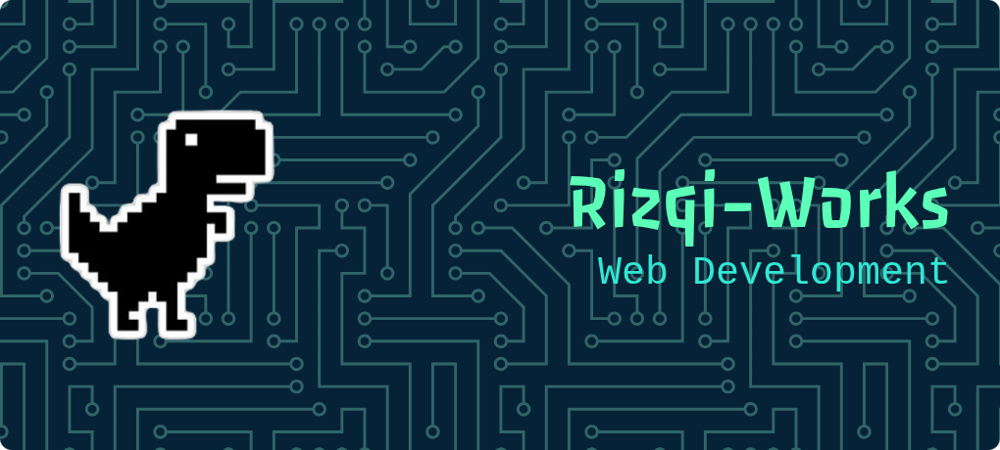

<!-- refresh -->

<!-- 
##### Skilss

##### Connect with Me

###### My Github Stats

 -->

#### About Me:
People who live life in all fields

#### Socials:
  

#### Tech Stack:
     

#### GitHub Stats:  
 

#### Play games with me

<picture>
  <source media="(prefers-color-scheme: dark)" srcset="https://raw.githubusercontent.com/rizqi-works/rizqi-works/output/pacman-contribution-graph-dark.svg">
  <source media="(prefers-color-scheme: light)" srcset="https://raw.githubusercontent.com/rizqi-works/rizqi-works/output/pacman-contribution-graph.svg">
  
</picture>

###

